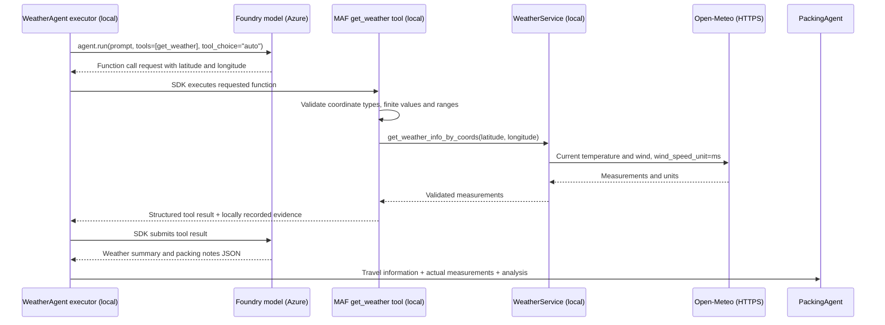

# Architecture overview

This is a local, single-request console demo, not a hosted application.
Microsoft Agent Framework orchestrates three executors using Azure AI Foundry
agents. Open-Meteo provides current weather without an API key.

```text
User input -> DestinationAgent -> WeatherAgent -> PackingAgent -> Console
```

## Module responsibilities

- `main.py` handles CLI arguments, interactive input, console output and exit codes.
- `workflow.py` creates the model clients, manages credentials and resources,
  builds the MAF Sequential workflow and applies the workflow timeout.
- `agents\destination_agent.py`, `agents\weather_agent.py` and
  `agents\packing_agent.py` each own one executor, its prompts and its model
  instructions. The workflow factory imports those instructions rather than
  duplicating them. Executors receive their model clients through their constructors.
- `weather_service.py` owns HTTP access to Open-Meteo; `config.py` owns environment
  configuration and `json_utils.py` owns JSON extraction and field validation.

The agent modules do not import the workflow or CLI. This keeps dependencies
one-way without an additional base class or factory abstraction.

## Agents and contracts

| Stage | Required model output | Failure handling |
|-------|-----------------------|------------------|
| Destination | Non-empty `destination` and `travel_type`; positive integer `duration` | Stop with a request to clarify; never replace the destination |
| Weather tool arguments | Finite numeric `latitude` in [-90, 90], `longitude` in [-180, 180] | Return a tool error; without any successful call, warn and use generic guidance |
| Weather analysis | Non-empty `weather_summary`; non-empty list of strings `packing_notes` | If measurements exist, warn and use them directly; otherwise discard model weather claims and use generic guidance |
| Packing | Non-empty recommendation text | Stop if empty |

`json_utils.safe_load_validated` extracts fenced or embedded JSON and rejects
non-object responses, missing required keys and invalid field values. Rejected
responses return an empty dictionary with warnings. Every caller reports these
warnings; only weather stages may continue with explicit fallback guidance.

The original request is retained separately from extracted fields, so timing,
activities and preferences reach the packing agent. Packing instructions request
English output regardless of input language and explicitly distinguish current
weather from seasonal advice. Console text and other agents' textual output are
also English; the traveler's Finnish/EU citizenship is separate from output language.
Model-based destination extraction and geocoding remain probabilistic.

## Architecture highlight: model-selected weather tool

**Sequential orchestration** controls the order of the three agents.
**Function calling** happens inside WeatherAgent: a Foundry model requests
`get_weather(latitude: float, longitude: float)`, but the model does not perform
HTTP requests. The local MAF SDK invokes the registered Python function, which
uses the injected `WeatherService` to call Open-Meteo at a fixed URL. The model
cannot choose an arbitrary endpoint.



The diagram shows a successful call; with `auto` the model can also answer
without calling a tool. There is no executor-driven HTTP fallback or forced
tool choice. One weather agent run can involve several model/tool round trips,
bounded by the SDK's iteration limit and the workflow timeout.

Successful tool results contain `status: "ok"`, the service's `weather` fields,
explicit `units` (Celsius and m/s), and a current-conditions scope notice.
Invalid coordinates or unavailable weather return `status: "unavailable"` and
an `error`; SDK argument-validation errors are returned through the SDK's tool
error path and reported in the console.

Only actual successful service results populate the downstream `weather` field.
The result state belongs to one executor invocation, so later trips cannot reuse
stale weather. If the model makes several calls, the last successful result in
invocation order wins, regardless of HTTP completion order. Later failed calls
do not erase an earlier success. The model receives the same selection rule.
Without any successful call, the executor discards model-authored weather claims,
prints a warning and sends `weather: null` with generic packing guidance.
Invalid final analysis after a successful call falls back to measured temperature
and wind. This is provenance protection for the measurement fields, not a
guarantee that every model-written recommendation is correct.

Illustrative console trace (not live measurements):

```text
Tool call: get_weather(latitude=60.17, longitude=24.94)
Tool result: get_weather -> {"status": "ok", "weather": {"temperature": 12, "wind_speed": 4, "latitude": 60.17, "longitude": 24.94, "source": "open-meteo"}, "units": {"temperature": "Celsius", "wind_speed": "m/s"}, "scope": "current conditions, not a travel-date forecast"}
```

This displays tool execution evidence, not the model's private reasoning.
Coordinates are still model-estimated rather than resolved by a verified
geocoding service; valid numeric coordinates do not prove the location is correct.

## Weather

The service requests current temperature in Celsius and wind in metres per
second (`wind_speed_unit=ms`). It checks the response shape, measurements and
reported units before accepting data. It does not retrieve precipitation,
historical conditions or travel-date forecasts.

A single `aiohttp.ClientSession` is reused, with a 10-second total HTTP timeout.
HTTP, network, timeout and invalid-response failures are visible and return no
weather. The packing agent then receives explicit weather-unavailable guidance.
Unexpected programming errors are not suppressed by the weather service.

## Configuration and lifetime

`AzureAIConfig` loads `.env` from the repository root without overriding shell
variables. The endpoint must be an HTTPS Foundry project endpoint containing
`/api/projects/<project>`, not an Azure OpenAI resource endpoint. A non-empty
model deployment name is required, with `gpt-4o-mini` as the default.

`DefaultAzureCredential` is shared across clients. Agents and credentials are
managed as async context managers; the weather session is closed in `finally`.
The workflow stream is consumed to completion and an absent final output is an
error. The console bounds the workflow to 120 seconds. Reported failures return
a non-zero exit code, including interruptions while entering a request.

## Dependencies and testing

The core framework and Azure provider are pinned to the same beta API generation.
The Azure Projects and MCP dependencies are pinned separately to prevent
unplanned API migrations. MCP 2.x is incompatible with this SDK's exception
imports. Only the required provider is installed, not the framework umbrella.
Other transitive dependencies are resolved by pip; there is no full lockfile.

Offline pytest tests exercise validation, configuration, HTTP error paths,
resource cleanup, CLI exit codes, direct-script and package-module entry points,
the real SDK workflow using fake agents, and model-selected function invocation
using scripted responses through the real SDK tool loop. Tool tests cover
argument validation, returned evidence, no-tool/failure fallbacks, repeated calls,
out-of-order completion and stale-state prevention. No test requires credentials
or internet access. Live authentication,
project permissions, model behavior and latency require a separate rehearsal
with the actual Azure project.
