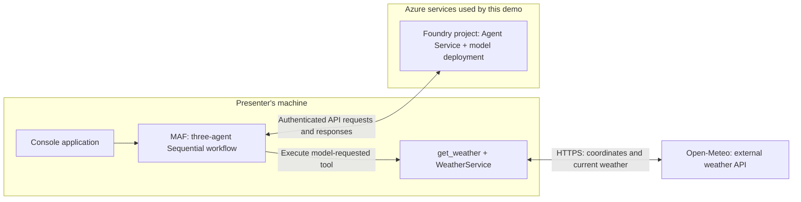
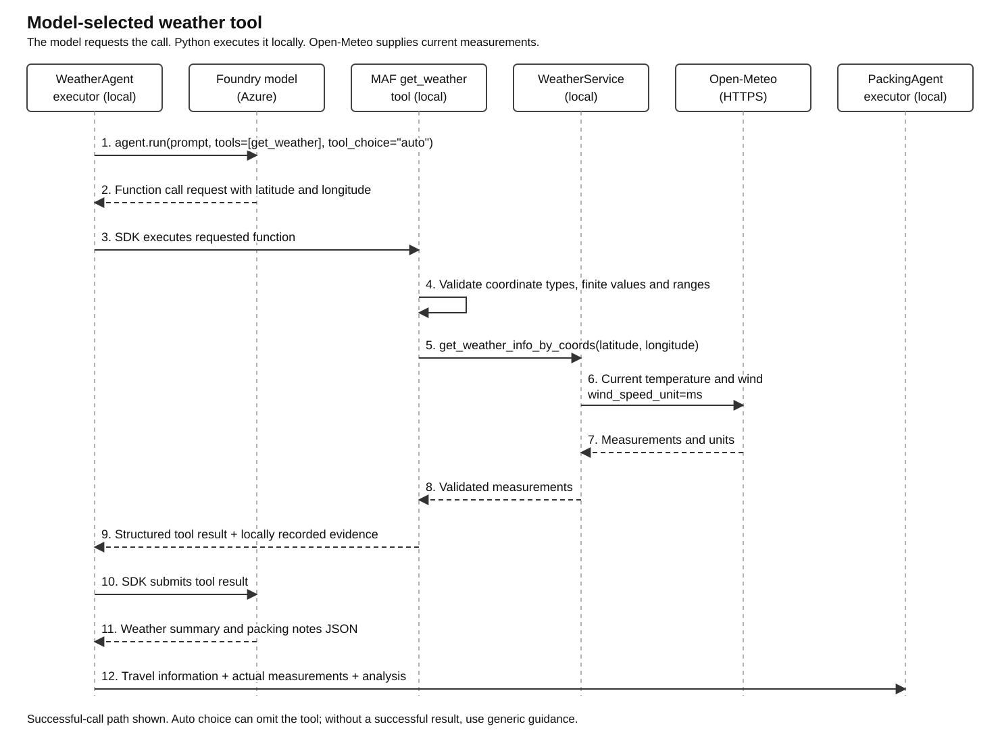

# Architecture overview

This demo turns a travel description into an English packing recommendation.
The Python application runs on the presenter's machine, uses Foundry for AI
model and agent services, and retrieves current weather from Open-Meteo.

**The main idea:** Microsoft Agent Framework (MAF) connects three specialized
agents into one workflow. The demo shows both a fixed agent sequence and a
model-selected tool call.

## Customer orientation: Azure Landing Zones, AI Landing Zones, Foundry and MAF

These concepts serve different purposes. **Landing zones provide the governed
Azure foundation, Foundry provides AI services, and MAF provides the software
building blocks for the agent application.**

| Suggested order | Building block | What it does | In this demo |
|-----------------|----------------|--------------|--------------|
| **1. Establish or reuse the foundation** | **Azure Landing Zone (Azure LZ)** | Organizes Azure subscriptions, access, networks, policies and monitoring for workloads | Not implemented |
| **2. Adapt the foundation for AI** | **AI Landing Zone (AI LZ)** | Extends that foundation for AI needs, such as model and data access, AI-service connectivity and usage controls | Not implemented |
| **3. Configure the AI services** | **Foundry** | Provides managed model and agent services, with capabilities for evaluation and monitoring | Supplies the project, model deployment and agent service |
| **4. Build and integrate the agents** | **Microsoft Agent Framework (MAF)** | Helps developers implement agents, connect tools and coordinate workflows | Runs the three-agent workflow and weather tool locally |

### How to use the 1-4 order

Start with the business use case and data requirements. For a production rollout,
use **Azure LZ -> AI LZ -> Foundry -> MAF** as a planning guide, not a mandatory
installation sequence. Platform work and application development can overlap.
A PoC such as this demo can begin with steps 3 and 4 in an approved development
environment; the applicable governance controls must still be in place before
production.

An Azure LZ includes a **platform landing zone** for shared foundations and
controls, and **workload landing zones** where application teams run their
solutions within those controls. Typically, the platform team owns the shared
foundation and the application team owns the agents and their integrations.

**Reuse an existing Azure LZ where possible.** AI LZ means adapting that
foundation for AI, not automatically building a second environment. Neither
landing zone is an extra step in the agent's runtime workflow.

The repository uses the name "Azure AI Foundry"; current Microsoft documentation
calls the platform "Microsoft Foundry". This document uses "Foundry" for both.

## What does MAF do in this demo?

MAF is an **open-source software framework**, not an AI model or an Azure
resource to provision. Developers install its libraries in their application.
It supports multiple AI providers; this demo chooses Foundry. Foundry can also
be used without MAF.

An **agent** combines model access, instructions for a particular role and,
optionally, tools it can call. These three agents use the same model deployment
with different instructions, not three separately trained models.
A **workflow** defines how their work is connected.

```text
Travel description -> DestinationAgent -> WeatherAgent -> PackingAgent -> Console
```

| Agent | Responsibility |
|-------|----------------|
| **DestinationAgent** | Extracts the destination, trip duration and travel type |
| **WeatherAgent** | Uses the weather tool when requested by the model, then summarizes the conditions |
| **PackingAgent** | Combines the travel request and weather guidance into a packing recommendation |

The MAF pattern is **Sequential orchestration**: the application defines the
order and MAF passes results from one step to the next. The model does not choose
which agent runs next. The original travel request is retained so preferences,
activities and timing reach PackingAgent.

In the code, `workflow.py` defines this sequence. Each `agents\*_agent.py` module
contains one agent's role and processing logic.

## Where does each part run?



The **workflow and custom weather tool run locally**. Model inference and
managed agent operations run in Azure. Using Foundry does not automatically
host this Python application there.

Travel prompts and tool results are sent to Foundry. Open-Meteo receives
coordinates, not the full travel request.

## Architecture highlight: model-selected weather tool

**Sequential orchestration decides the agent order. Function calling lets the
model request an action inside an agent.** These are two different mechanisms
used together in this demo.

WeatherAgent exposes `get_weather(latitude, longitude)` to the model.
When the model requests a call, MAF executes the Python function locally.
The function validates the coordinates and uses `WeatherService` to fetch
current measurements from Open-Meteo. MAF returns the result to the model
so it can write the weather summary before the workflow moves to PackingAgent.



**The model requests the call; Python performs the HTTP request.** The model
does not choose an arbitrary service URL. The console shows `Tool call:
get_weather(...)` and `Tool result: get_weather -> ...` as evidence of execution.

Tool choice is automatic (`auto`), not forced. If the model does not call the
tool, or no call succeeds, the application warns and uses generic packing
guidance instead of trusting model-only weather claims. If measurements arrive
but the model's summary is invalid, the application uses the measurements
directly. One weather agent run can involve several model/tool round trips.

## What this demo does and does not prove

The demo illustrates **MAF orchestration, Foundry integration and local tool
execution**. It does not implement an Azure or AI landing zone, private-network
isolation or a production operating model.

Weather data covers **current temperature and wind**, not a forecast for the
travel dates. Coordinates are model-estimated, so an ambiguous destination can
still lead to the wrong location. Packing recommendations are model-generated
guidance, not guaranteed travel advice or a verified luggage plan.

For production, the platform and application teams must address data handling,
access, networking, evaluation, monitoring and operational ownership. A landing
zone supports that environment; it does not by itself make model answers correct.

For setup, execution and tests, see the [README](../README.md).

## Microsoft references

- [What is an Azure landing zone?](https://learn.microsoft.com/en-us/azure/cloud-adoption-framework/ready/landing-zone/)
- [Cloud Adoption Framework: AI Ready](https://learn.microsoft.com/en-us/azure/cloud-adoption-framework/ai/ready)
- [What is Microsoft Foundry?](https://learn.microsoft.com/en-us/azure/foundry/what-is-foundry)
- [Microsoft Agent Framework overview](https://learn.microsoft.com/en-us/agent-framework/overview/)

The links explain the current concepts. This demo uses pinned SDK versions,
so examples in current product documentation may use different APIs.
